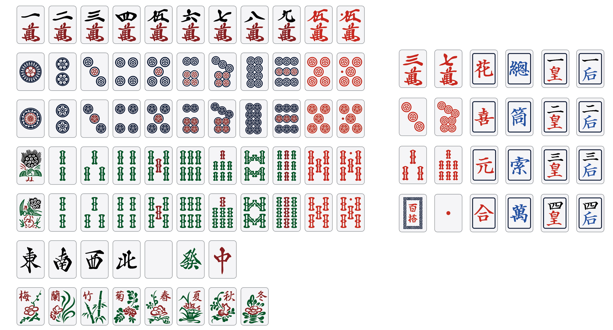

# Mahjong graphic 麻将牌图形



[github原始仓库](https://github.com/lietxia/mahjong_graphic)  
[gitee国内仓库](https://gitee.com/lietxia_admin/mahjong_graphic)  

下载方式：  
[github下载](https://github.com/lietxia/mahjong_graphic/archive/refs/heads/main.zip)  
[gitee下载](https://gitee.com/lietxia_admin/mahjong_graphic/repository/archive/main.zip)

部分图形是来自于【一点麻将】  
(一万至九万、东南西北白发中，其中一种一索，其中一种一筒)  
https://github.com/SyaoranHinata/I.Mahjong  
一点麻将是用GL-MahjongTile修改的  

贴吧里
https://tieba.baidu.com/p/4098240522
和
https://tieba.baidu.com/p/4098238310
都是我发的贴子

# 许可
本字型檔案採用「M+字型授權條款」釋出。如下：

```
這些字型爲自由軟件，您可以自由使用、複製和分發它。不論是否修改過它，不論作爲商業使用還是作爲非商業性使用，都是許可的。 我們按照這些字型的「現狀」釋出它們，然而我們並無責任確保這一點。

These fonts are free softwares. Unlimited permission is granted to use, copy, and distribute it, with or without modification, either commercially and noncommercially. THESE FONTS ARE PROVIDED "AS IS" WITHOUT WARRANTY.

これらのフォントはフリー（自由な）ソフトウエアです。 あらゆる改変の有無に関わらず、また商業的な利用であっても、自由にご利用、複製、再配布することができますが、全て無保証とさせていただきます。
```
